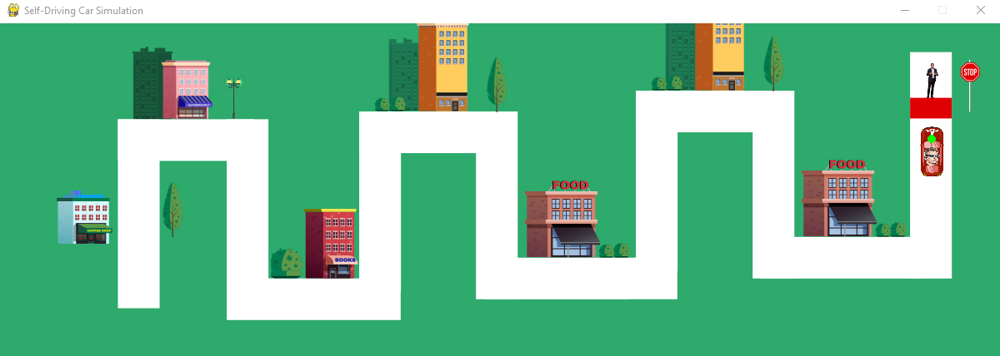

<h1>
  self driving
</h1>
<h3>
  summary 
</h3>

  This Python code utilizes the Pygame library to simulate a self-driving car navigating a predefined track image (track.png). The simulation works by continuously checking pixel values around a simulated camera point, enabling the car to adjust its movement and direction accordingly. The car, represented by a scaled image (tesla.png), is equipped with a "camera" positioned relative to its current location, which detects pixel colors (e.g., white for the track) to determine the road boundaries.

The program uses a game loop to handle events, update car positions, and render the track, car, and camera visualization in real-time. Based on pixel data at the focal points in specific directions (up, right, down), the car's direction changes when it encounters turns. It rotates and offsets its simulated camera accordingly to follow the track. Directional states (up, right, down) dictate whether the car moves forward, turns, or adjusts offsets.

Error handling ensures that essential assets are loaded, and safeguards are included to prevent crashes if the car moves out of bounds. Additionally, the frame rate is capped at 60 frames per second for smooth simulation. Visual debugging aids, such as a green dot indicating the camera position, make the simulation easier to observe.

This program demonstrates fundamental concepts of autonomous navigation, such as pixel-based sensor simulation, state-driven movement, and dynamic rendering, making it a practical example of self-driving technology on a small scale.

<h3>the output looks like :-</h3>

  

